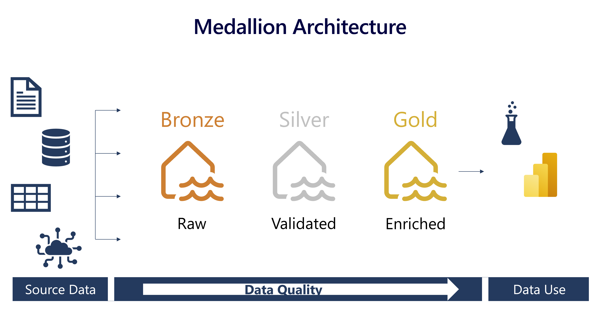

# Architecture Design

## Overview
Implementation of Medallion Architecture in Microsoft Fabric for IBM financial data processing, I used the following diagram in order to implement the design with only one key difference, the bronce and silver layer belong to a lakehouse and the gold layer belongs to a warehouse.

## Bronze Layer (Raw Data)
**Purpose:** To store raw, unprocessed data.
I used Vantage API to retrieve data from the stock market and store it in a file within a lakehouse

## Silver Layer
**Purpose:** To clean, adjust the data and store it in a delta table format in the same lakehouse.

## Gold Layer
**Purpose:** To store enriched data ready for Power BI dashboards, in the following image we can see the cleand and enriched data in a structured table in the gold data warehouse

