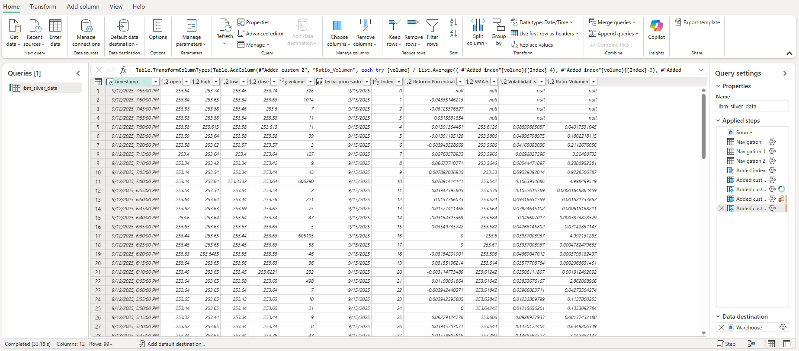

# Dataflow Design

## Overview
The primary purpose of the dataflow gen2 is to transform data as it moves it from one place to another, so since the data is being moved from the lakehouse to the gold warehouse, there's going to be heavy transformations in it but in this section so the DAX code is provided as well. The folllowing image shows all the new columns and steps performed in the dataflow.




### Index
First we create an index in order to compute the addedd columns after, this because we need to track previous rows in future calculations.

### Return Percentage
**Purpose:** Measure the daily price change as a percentage.

**Formula:**
Return (%) = [(Current Close - Previous Close) / Previous Close] × 100

**Implementation:**
```powerquery
try (([close] - #"Added index"[close]{[Index]-1}) / (#"Added index"[close]{[Index]-1}))*100 otherwise null
```
asdasd

