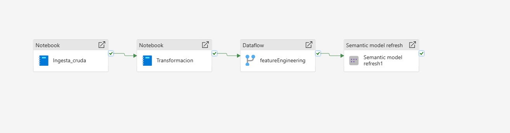

# Pipeline Configuration

## Overview
This pipeline orchestates all the fabric items in order to run the workflow every day so the dashboard can be updated with fresh data everyday.

## Dynamic Parameters
The notebooks can take 1 parameter to change the company's name so we can retrieve data from diferent companies that are available in the vantage API.

## Design
In the following image you can see the diferent items that were used for the project.

